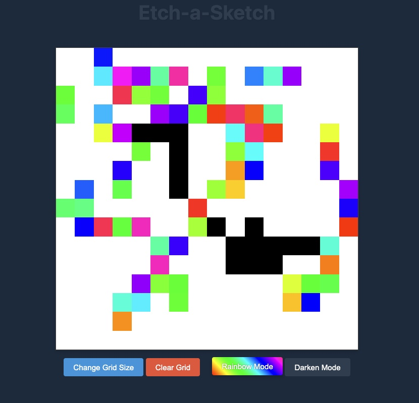

# Etch-a-Sketch Project



A browser-based sketchpad inspired by the classic Etch-A-Sketch toy, built with JavaScript, HTML, and CSS.

## Features

- Dynamic grid generation (default 16x16)
- Hover effect that leaves a colored trail
- Adjustable grid size (up to 100x100)
- Responsive design using Flexbox
- Interactive controls

## Extra Features

- Random color mode (RGB values)
- Progressive darkening effect (10% per interaction)

## Installation

1. Clone this repository:
   ```bash
   git clone https://github.com/your-username/etch-a-sketch.git
   ```
2. Open `index.html` in your web browser.

## Usage

1. Move your mouse over the grid to draw
2. Click the "Change Grid Size" button to adjust the dimensions
3. Try out the different coloring modes

## Technologies Used

- HTML5
- CSS3 (Flexbox)
- JavaScript (DOM manipulation)

## Project Structure

```
etch-a-sketch/
├── index.html        # Main HTML file
├── style.css         # CSS styles
├── index.js          # JavaScript functionality
└── README.md         # This file
```

## Contributing

This project was created as part of The Odin Project curriculum. Contributions are welcome - please open an issue or pull request.

## License

[MIT](https://choosealicense.com/licenses/mit/)
